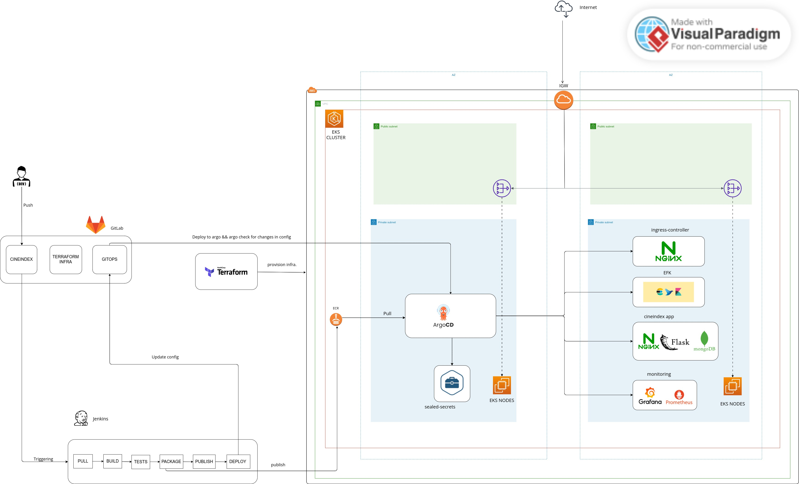

# CineIndex DevOps Project

**CineIndex** is a comprehensive DevOps project created as the final project for the DevOps Bootcamp training with [Develeap](https://www.develeap.com/). The purpose of this project is to demonstrate a range of DevOps practices and technologies, including Python Flask application development, CI/CD pipelines, cloud-based infrastructure, microservices deployment, GitOps, logging and monitoring.

## Project Overview

The **CineIndex Application** is a Python Flask-based web application that provides a user-friendly interface to search for and save movies associated with specific actors. Utilizing data from the TMDb API, users can enter an actor's name to retrieve their movie catalog, which is then displayed with details such as movie titles, release dates, and character roles. The application allows users to mark their favorite actors and their respective movie credits, all of which are stored and managed in a MongoDB database.

### Technologies Used

- **Development:** Python (Flask)
- **Containerization:** Docker
- **Docker Image Registry:** Amazon Elastic Container Registry (ECR)
- **Database:** MongoDB
- **Scripting:** Bash
- **Infrastructure as Code:** Terraform
- **Cloud Provider:** Amazon Web Services (AWS)
- **Kubernetes Provider:** Amazon Elastic Kubernetes Service (EKS)
- **Kubernetes Packaging:** Helm
- **Ingress:** Nginx Ingress Controller
- **CI/CD:** Jenkins
- **GitOps:** Argo CD
- **Logging:** EFK (Elasticsearch, Fluentd, Kibana)
- **Monitoring:** Prometheus, Grafana(Kube-Prometheus stack)

# Project Architecture



# Docker

The application uses a multi-stage Dockerfile to build a lean runtime Docker image for efficient deployment. Docker Compose is also employed for local development and testing purposes.

# CI/CD Pipeline

The CI/CD pipeline is an integral part of the CineIndex project, enabling automated building, testing, packaging, and deployment of the application. The pipeline is implemented as a multibranch Jenkins pipeline.

### Stages of the CI/CD Pipeline

1. **Clone** : The pipeline begins by cloning the repository, fetching the latest codebase for processing.
2. **Set Version** : This stage is triggered on the main branch. It retrieves the latest Git tags and determines the version (tag) for the current build. This version information is crucial for tracking and labeling the deployed application. The retrieved version is used when packaging the Helm chart and for tagging Docker images before publishing. This ensures accurate versioning and traceability throughout the CI/CD pipeline.
3. **Build (Docker image)** : The Docker image for the application is constructed using a multi-stage Dockerfile. This optimized image serves as the runtime environment for the application.
4. **End-to-End Test** : Thorough end-to-end testing is performed using Docker Compose. The application is interacted with through various operations like POST, GET, and DELETE, ensuring its robustness and functionality. This stage is executed on both the main and feature/* branches.
5. **Package (Helm chart)** : The application is encapsulated within a Helm chart, simplifying its deployment and management within Kubernetes.
6. **Publish** : On the main branch, the application's Docker image is published to the Amazon Elastic Container Registry (ECR), making it available for deployment.
7. **Deploy** : If on the main branch, the GitOps configuration repository is updated. This triggers Argo CD to deploy the new version of the application using the tagged image, ensuring consistency between the desired state and the actual state in the Kubernetes cluster.

# Development Workflow

- The `main` branch is designated for running stable releases.
- Development occurs in feature branches (`feature/*`).
- Commits to feature branches trigger the Jenkins pipelines for CI/CD.

# Cloud Infrastructure (eks)

CineIndex leverages a robust terraform infrastructure deployment solution to effortlessly set up an Amazon Elastic Kubernetes Service (EKS) environment. This comprehensive solution automates the provisioning and configuration of an EKS cluster, networking components, and essential IAM roles. In addition, it seamlessly integrates Argo CD for a streamlined continuous deployment process, ensuring efficient application lifecycle management within Kubernetes.

**Understanding the "infra/eks" Directory for CineIndex:**

The "infra/eks" directory of CineIndex follows a modular structure designed to enhance organization and code reusability. It contains two vital modules:

1. **EKS Module**: This module orchestrates the provisioning and configuration of the Amazon EKS cluster and its related components. It addresses aspects such as worker nodes, crucial addons, IAM roles, and more. Its design ensures a comprehensive and efficient EKS setup tailored to CineIndex.
2. **Network Module**: Responsible for networking infrastructure, this module establishes the foundation of connectivity and security. It constructs the VPC, configures subnets, security groups, and manages internet gateways, ensuring a secure and functional environment for CineIndex.

**Quick Start Guide for CineIndex:**

To deploy CineIndex on the infrastructure use the following simple steps:

1. Ensure your AWS credentials are set up, and the AWS CLI is configured properly.
2. Navigate to the "infra/eks" directory within the CineIndex project.
3. Personalize input variables in the "variables.tf" file to align with the specific requirements of your CineIndex project. You can also use a ".tfvars" file for specifying variable values.
4. Optionally, configure the Terraform backend by creating a "backend.tf" file with the appropriate settings.
5. Initialize Terraform and configure the backend using the following command:

   ```
   terraform init -backend-config=backend.tf
   ```
6. Review the proposed infrastructure changes using `terraform plan`.
7. Execute the deployment by running `terraform apply`.
8. Monitor the Terraform output for potential errors or any additional instructions.
9. Upon successful deployment, your EKS cluster will be accessible via the kubectl utility. Additionally, you can utilize the Argo CD interface to effectively manage your Kubernetes applications for CineIndex.

# Argo CD Configuration

The argocd-config directory plays a pivotal role in orchestrating the GitOps-based continuous deployment and management of Kubernetes applications within the CineIndex project. This directory follows a structured layout that contains various configuration files and Helm charts, enabling seamless and automated deployment using Argo CD.

## Components

The app-of-apps/ directory holds "Application of Applications" manifests, outlining Cert-Manager, CineIndex, Ingress Controller, Logging, Monitoring, and Sealed Secrets. The charts/ directory contains Helm charts for each application, bundling Kubernetes configurations. Argo CD deploys using these manifests for GitOps, ensuring synced cluster states. The structured layout allows flexible customization and scalability, enabling effortless addition of new apps while maintaining coherence.

# **How to Run Locally**

To run the CineIndex application locally, follow these steps:

1. **Clone the Repository**: Clone the CineIndex repository to your local machine.
2. **Build the Docker Image**:

   - Navigate to the root directory of the repository.
   - Open a terminal and execute the following command to build the Docker image:
     ```bash
     docker build -t cineindex-app .
     ```
3. **Build the Frontend Proxy Image**:

   - Navigate to the "frontend" directory within the repository.
   - Open a terminal and execute the following command to build the frontend proxy Docker image:
     ```bash
     docker build -t cineindex-proxy .
     ```
4. **Run with Docker Compose**:

   - Return to the root directory of the repository.
   - Create a file named `.env` in the root directory and define the required environment variables. For example:
     ```plaintext
     MONGO_USERNAME=myusername
     MONGO_PASSWORD=mypassword
     MONGO_DATABASE=cineindexdb
     MONGO_HOST=db
     MONGO_PORT=27017
     API_KEY=your_api_key_here
     ```
   - Open a terminal and execute the following command to start the application using Docker Compose:
     ```bash
     docker-compose up -d
     ```
5. **Access the Application**:

   - Open a web browser and navigate to `http://localhost:8090` to access the CineIndex application.
6. **Stop and Cleanup**:

   - To stop the application, execute the following command in the same terminal where Docker Compose was started:
     ```bash
     docker-compose down -v
     ```
   - This will stop and remove the Docker containers. The `-v` flag will also remove the associated volumes, which store persistent data.

**Note:** The above instructions assume you have Docker and Docker Compose installed on your machine. Make sure to replace the placeholders in the environment variables with appropriate values for your setup.

Enjoy exploring and interacting with the CineIndex application locally!
